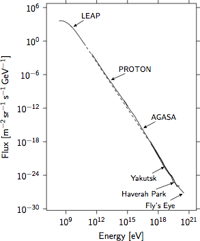

Artist makes beautiful plots
============================

In short
--------

Artist is a 2D plotting library for Python.  It's main focus is the
output.  Artist creates a LaTeX file which can be included in your paper
or thesis.  The code needs TikZ and PGFPlots to compile and your plots
will tightly integrate with your main text.  Artist provides an
easy-to-use and clean Python interface and can compile your plot
on-the-fly as a stand-alone PDF file.

For instance the `cosmic-ray flux spectrum <demo/demo_spectrum.py>`_:

Rationale
---------

Artist enables you to visualize the results of your data analysis.  The
quality of your plots should reflect the quality of your analysis.  With
most software, this is hardly possible and the term 'publication quality'
takes on an entirely new meaning.  As a result, many papers and theses
suffer from inconsistent and generally poor-quality plots.

Fortunately, some solutions are available.  For LaTeX users, one can use
PGF/TikZ for generating figures and plots.  This ensures a very consistent
display throughout your document.  PGFPLOTS builds on that to provide a
user-friendly interface for many kinds of plots and to allow extensive
customization.

For many users, however, it is more convenient to use a programmatic
interface from your favorite programming language.  For Python, such an
interface is available in Artist.

Artist can be used in place of other plotting libraries, but the output is
a LaTeX file requiring PGF/TikZ and PGFPLOTS.  Previewing the output is
possible by means of a simple method which renders the plot as a PDF.

The style of the plots is based on the work of William S. Cleveland.
