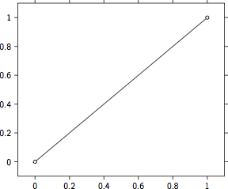
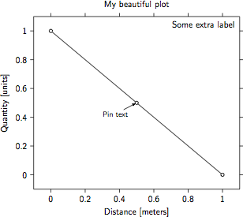
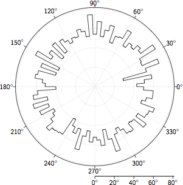

Tutorial
========

The artist package can be used to create beautiful plots. The output
will be a TeX file that can be included in a larger document or compiled
on its own. This page describes the steps needed to create a plot, the
options that are available, and provides some examples.

Basic plot
----------

The bare minimum to create a simple plot are::

    from artist import Plot
    graph = Plot()
    graph.plot([0, 1], [0, 1])
    graph.save('simple_plot')

This imports the :class:`artist.Plot` class from artist, then initiates
a single plot. In this plot multiple lines and marks can be drawn. In
this case one line is draw from (0, 0) to (1, 1). Finally the
``simple_plot.tex`` file is created. To directly get viewable output use
``save_as_pdf`` instead of ``save`` to output a ``.pdf`` file instead of
a ``.tex``. The result:

Adding labels
-------------

Once you have initiated the Plot you can add a title and axis labels.
Here is an example::

    from artist import Plot
    graph = Plot()
    graph.plot([0, .5, 1], [1, .5, 0])
    graph.set_title('My beautiful plot')
    graph.set_ylabel('Quantity [units]')
    graph.set_xlabel('Distance [meters]')
    graph.add_pin_at_xy(.5, .5, 'Pin text', location='below left')
    graph.set_label('Some extra label')
    graph.save('labels_plot')

This examples adds a title to the plot, axis labels, text connected to a
data point, and finally a label to the plot. This looks like this:

Polar plot
----------

Besides cartesian axes there is also support for polar axes. These are
initiated by the :class:`artist.PolarPlot`::

    import numpy as np
    from artist import PolarPlot
    graph = PolarPlot()
    x = np.random.uniform(0, 360, 5000)
    n, bins = np.histogram(x, bins=np.linspace(0, 360, 91))
    graph.histogram(n, bins)
    graph.save('polar_plot')

This imports the :class:`artist.PolarPlot` class from artist. Then a
histogram is created with bins ranging from 0 to 360. The result:

